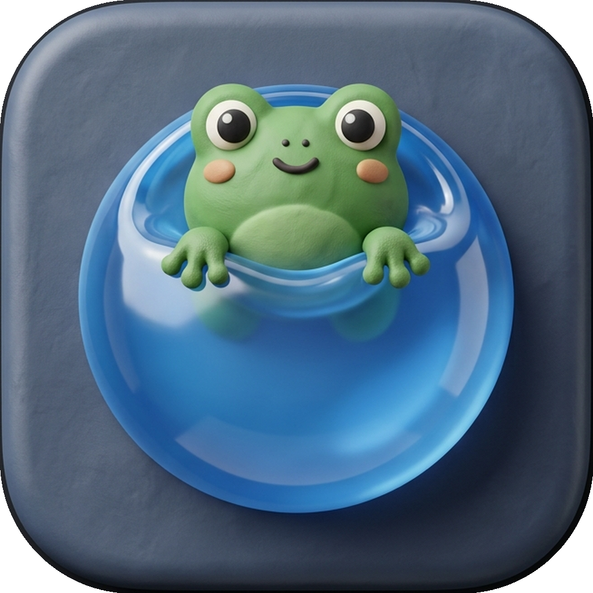
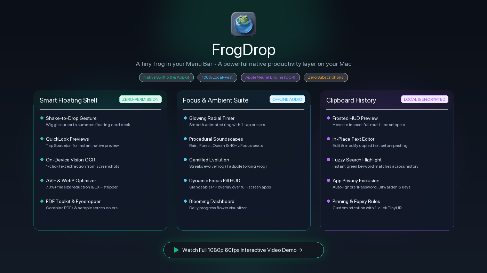

# 🐸 FrogDrop

<p align="center">
  
</p>

<p align="center">
  <strong>A tiny frog in your Menu Bar. A powerful productivity layer on your Mac.</strong><br>
  <em>Replaces 5+ paid menu bar apps with a single, delightful, zero-subscription native utility.</em>
</p>

<p align="center">
  
  <a href="https://github.com/sarthak-SyntaxSamurai/FrogDrop/actions/workflows/build.yml">
    
  </a>
  
  
  
  
  
  <a href="https://github.com/sponsors/sarthak-SyntaxSamurai">
    
  </a>
</p>

---

## 👀 Preview

<p align="center">
  <a href="https://www.youtube.com/watch?v=uHfZnFQXAdY">
    
  </a>
</p>

---

## ⚡ Why FrogDrop?

Your menu bar shouldn't cost $30/month or drain your RAM with separate background daemons. FrogDrop unifies your entire desktop workflow into one lightweight, animated native mascot.

| What it Replaces | Traditional Stack | With FrogDrop 🐸 |
|---|---|---|
| **Dropzone & File Shelves** | Paid apps (Dropover, Yoink) | **Shake cursor** to summon floating shelf, batch stack drag, spacebar QuickLook |
| **Clipboard History** | Paid utilities (Paste, Maccy) | 100+ clips, **frosted HUD hover preview**, **live in-place editor**, app ignore rules |
| **Focus & Pomodoro** | Subscriptions (Session, Forest) | **Offline procedural ambient audio**, **Frog Evolution stages**, Dynamic Island floating HUD |
| **Media & Privacy Toolkit** | Multiple web tools / scripts | **On-device Apple Vision OCR**, **AVIF/WebP converter**, **EXIF metadata stripper**, Eyedropper |
| **Task Checklist** | Heavy task apps | **1-tap rapid task capture** directly inside menu bar popover |

---

## ✨ Features at a Glance

### 🐸 1. The Living Menu Bar Mascot
A hand-drawn animated frog lives directly inside your macOS menu bar:
- **Interactive Moods**: Naturally blinks, winks, shifts to focused brows during active timers, and sticks its pink tongue out when files are dropped.
- **Left-Click**: Instant access to your Productivity Dashboard, Clipboard, Dropzone, Focus Suite, and Todos.
- **Right-Click**: Instant Quick Context Menu (*Check for Updates, Preferences, Quit*).

---

### 📦 2. Smart Floating Shelf & Dropzone
*Drag files anywhere across your Mac — transform, convert, and route them in one click.*

- **🪟 Shake-to-Drop Gesture**: Wiggle your mouse while dragging files anywhere to summon a floating shelf under your pointer (`CursorTracker`).
- **🔍 Spacebar QuickLook Previews**: Tap `Spacebar` or the eye icon on any card/file for instant full-size native macOS previews (`QLPreviewPanel`).
- **👁️ On-Device Vision OCR**: Drag any screenshot, receipt, or photo → 1-click extract formatted text to clipboard via Apple Neural Engine.
- **🛡️ EXIF & Privacy Inspector**: Interactive floating window to inspect camera, lens, and GPS coordinates — with 1-click metadata stripping before sharing.
- **⚡ Modern AVIF, WebP & Lossless Optimizer**: Convert PNG/JPG to next-gen AVIF/WebP or compress losslessly, saving 70%+ file size.
- **📄 PDF Toolkit**: Drop multiple PDFs or images to merge them into a single clean PDF document in seconds.
- **🎨 1-Click Screen Eyedropper**: Sample any pixel on screen and copy formatted `#HEX` / `RGB` color codes instantly.
- **Stacked Card Decks & Batch Dragging**: Move the entire batch of shelved files together in one drag, or expand into individual items.
- **Custom Folder Grids & Sharing**: Pin frequent destination folders with duplicate collision protection, AirDrop, Imgur upload, and Zip archives.

---

### ⏱️ 3. Froggy Focus, Pomodoro & Ambient Suite
*Designed for deep work sessions with atmospheric audio and gamified habit building.*

- **⏱️ Glowing Radial Timer Ring**: Smooth animated circular progress ring with 1-tap quick presets (*25m Pomodoro, 50m Deep Work, 15m Sprint, 5m Break*).
- **🎵 Offline Procedural Ambient Audio**: Built-in soundscapes (*Rain, Ocean Waves, Pine Forest, Pink Noise, 40Hz Focus Beats*) with a live volume slider — 100% offline via AVFoundation.
- **🔥 Habit Streaks & Frog Evolution**: Maintain daily focus streaks and earn Golden Flies to evolve your frog (*Tadpole ➔ Baby Frog ➔ Ninja Frog ➔ King Frog*).
- **🏝️ Dynamic Island Floating Focus Pill**: Always-on Picture-in-Picture glanceable HUD that stays visible over full-screen apps and Xcode.
- **Session Logs & Blooming Flower Dashboard**: Every completed focus session logs detailed stats, visually blooming your daily progress flower.

---

### 📋 4. Supercharged Clipboard History
*Silently captures everything you copy with rich inspection, instant editing, and privacy filters.*

- **🔍 Frosted HUD Full Preview**: Hover over any snippet to see its complete multi-line content in a floating glass window.
- **✏️ In-Place Text Editor**: Tap the pencil icon to edit and tweak copied text snippets directly before pasting or re-copying.
- **🎯 Live Search with Keyword Highlighting**: Instant fuzzy search with real-time green match highlights across your entire history.
- **🔗 1-Click Link & File Path Opener**: Auto-detects URLs and local file paths with an instant open-in-browser / Finder shortcut.
- **📌 Pinning & Retention Control**: Pin important snippets permanently; auto-expire standard items after 1 day or custom duration.
- **🛡️ Per-App Privacy Rules**: Mark sensitive apps (1Password, Bitwarden, Keychain) to automatically ignore or set temporary auto-purge.
- **🎨 Color Swatch & TinyURL Badges**: Live visual preview for copied `#HEX` / `RGB` codes and 1-click TinyURL generator.
- **🔔 Floating HUD Toasts**: Subtle non-intrusive popup showing what was just copied along with the source application badge.

---

### ✅ 5. Quick-Add Todo List
*A zero-friction task checklist for thoughts and quick steps.*

- **Rapid Task Capture**: Jot down immediate to-dos, bugs, or next steps in seconds without switching contexts.
- **Completion Toggles & Progress**: Check off items as you finish focus sessions and track your daily completion rate.

---

### 🔄 6. Native In-App Updater
*Seamless on-demand updates without ever visiting a browser.*

- **1-Click On-Demand Checker**: Checks GitHub Releases API directly from the menu bar or preferences.
- **In-Place Atomic Update**: Downloads the release archive, removes macOS quarantine flags, signs ad-hoc, and relaunches the app automatically.
- **100% On-Demand**: Zero background network polling, zero telemetry, zero battery drain.

---

## ⌨️ Power-User Shortcuts & Gestures

| Gesture / Shortcut | Action |
|---|---|
| **Mouse Wiggle while Dragging** | Summons the Floating Shelf under your cursor |
| **`Spacebar` on Card / File** | Opens full-size native macOS QuickLook preview |
| **Hover on Clipboard Row** | Shows floating Frosted Glass multi-line preview HUD |
| **`Pencil Icon` on Clip** | Opens in-place editor modal to modify copied text |
| **Right-Click Menu Bar Frog** | Opens instant Quick Menu (*Updates, Preferences, Quit*) |
| **Global Hotkey** *(Configurable)* | Toggles main FrogDrop popover from anywhere |

---

## 🔒 Privacy & Security First

Everything is 100% local. FrogDrop never tracks you and makes zero background network requests.

- **Local Storage**: All history and preferences live securely on your Mac at:
  ```
  ~/Library/Application Support/FrogDrop/history.json
  ```
- **External Calls**: Network access is only used when explicitly requested by you (AirDrop, Imgur upload, TinyURL shortening, or manual update checks).
- **Password Manager Protection**: Built-in rules to ignore copied passwords from 1Password, Bitwarden, KeePassXC, and Apple Keychain.

---

## 🤔 "Is this a virus?" (macOS Security Warning)

Because FrogDrop is **100% free and open source**, it is not signed with a paid Apple Developer certificate ($99/year), which triggers macOS Gatekeeper on manual DMG downloads.

**Verify it yourself in 30 seconds:**
> Copy this repo link → paste it into ChatGPT, Gemini, or Claude → ask: *"Is this a legit open-source Swift app or malware?"*
> 
> 🔗 `https://github.com/sarthak-SyntaxSamurai/FrogDrop`

Every line of code is open source and auditable. Installing via **Homebrew Cask** bypasses the Gatekeeper prompt automatically.

---

## 🚀 Installation

### ⭐ Method 1: Homebrew Cask (Recommended)

```bash
brew tap sarthak-SyntaxSamurai/tap
brew install --cask frogdrop
```

### ⚡ Method 2: One-Liner Terminal Installer

```bash
curl -fsSL https://raw.githubusercontent.com/sarthak-SyntaxSamurai/FrogDrop/main/install.sh | bash
```

### 📦 Method 3: Manual DMG Release

1. Download the latest `FrogDrop.dmg` from [GitHub Releases](https://github.com/sarthak-SyntaxSamurai/FrogDrop/releases/latest).
2. Drag `FrogDrop.app` to your `Applications` folder.
3. If prompted with a security warning, run once in Terminal:
   ```bash
   xattr -cr /Applications/FrogDrop.app
   ```

---

## 🛠️ Build from Source

```bash
# Clone the repository
git clone https://github.com/sarthak-SyntaxSamurai/FrogDrop.git
cd FrogDrop

# Compile optimized release binary
swift build -c release
```

*Requirements: macOS 14.0+ (Sonoma / Sequoia) and Xcode Command Line Tools.*

---

## 🏗️ Architecture & Tech Stack

| Component | Technology |
|---|---|
| **Core Framework** | Swift 5.9 + SwiftUI + AppKit |
| **Computer Vision & OCR** | Apple Vision Framework (`VNRecognizeTextRequest`) |
| **Image & Privacy Engine** | ImageIO + CoreGraphics (AVIF / WebP / Lossless / EXIF) |
| **Ambient Soundscapes** | AVFoundation (`AVAudioEngine` procedural offline sound) |
| **Quick Previews** | QuickLook Framework (`QLPreviewPanel`) |
| **Local Persistence** | Native Swift JSON serialization + UserDefaults |
| **Packaging & DMG** | SwiftPM + Custom Retina multi-resolution TIFF background |

---

## 💬 Community & Feedback

Found a bug, want to request a feature, or have a suggestion?
- **[Open a GitHub Issue](https://github.com/sarthak-SyntaxSamurai/FrogDrop/issues)** — All feedback is actively reviewed!
- Pull requests and community contributions are warmly welcomed.

---

## 💖 Support FrogDrop

FrogDrop is proudly **free and open-source forever**. If it saves you time and simplifies your Mac workflow, consider starring the repository or supporting ongoing development:

<p align="center">
  <a href="https://github.com/sponsors/sarthak-SyntaxSamurai">
    
  </a>
</p>

---

<p align="center">
  MIT License · Crafted with 🐸 by <a href="https://github.com/sarthak-SyntaxSamurai"><strong>@sarthak-SyntaxSamurai</strong></a>
</p>
