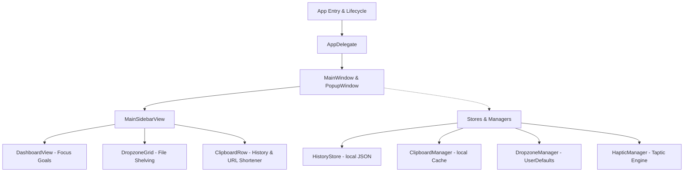

# 🐸 FrogDrop

> **The Ultimate macOS Menu Bar Companion**
>
> A beautiful 3-in-1 Menu Bar productivity tool fusing your **Clipboard History**, **Drag-and-Drop Dropzone Hub**, and **Pomodoro Daily Goal Tracker** into a single cohesive, premium macOS experience.

  

  
  
  
  

---

## 📸 Screenshots

| 🏡 Daily Dashboard & Goal Blooming | 📦 Dropzone Hub (Drag/Click Grid) |
| --- | --- |
|  |  |

| 📋 Clipboard Manager & Link Shortener | ⚙️ App Preferences & Aligned Rules |
| --- | --- |
|  |  |

---

## 🌟 The 3-in-1 Core Features

### 1. 📦 Interactive Dropzone Workspace
Drag files or folders to the Menu Bar status icon to "shelve" them. 
* **Dynamic Grid**: Click folders in your custom target grid to move shelved files instantly, or open directories in Finder if the shelf is empty.
* **Built-in Actions**: Trigger actions like AirDrop, Email, Imgur uploads, and Path Copying. 
* **Fallback Mode**: If you click any action button when the shelf is empty, FrogDrop automatically prompts you with a native file dialog to choose target files on the fly.

### 2. 📋 Smart Clipboard History Manager
Track copied text strings, URLs, and image captures.
* **Pin & Keep**: Pin items to keep them permanent in your clipboard database.
* **Hover Link Shortener**: Hover over any URL in your history to see a `link.badge.plus` button. Click it to call the TinyURL API, shorten the link, and copy it back to your pasteboard.
* **Modern Swipe Actions**: Easily swipe to delete or copy clipboard items.

### 3. ⏱️ Daily Focus Timer & Goal Tracker
Keep track of your focus targets with an interactive Pomodoro style timer.
* **Blooming Tulip Indicator**: Watch your progress come to life! A beautifully styled custom flower card features a Tulip that gradually blooms into a full-flowered rose as you complete daily Pomodoro sessions.
* **Goal Settings**: Modify your daily focus minute goals and log named task sessions.

---

## 🔒 Local-First Privacy (No Data Uploads)

> [!IMPORTANT]
> **Your data is 100% private and stays locally on your Mac.**
> FrogDrop does NOT upload, track, or share your clipboard history, files, or task sessions. 

### Where is your data stored?
All information is kept strictly on your local machine under the application support directory:
* **Clipboard & Session Database**: `~/Library/Application Support/FrogDrop/history.json`
* **Local Settings**: Stored securely using macOS `UserDefaults`.

Both `history.json` and compiled binary caches are explicitly configured in `.gitignore` so they are never tracked in Git or pushed to GitHub.

---

## 🛠️ App Architecture & File Structure

### Components:
* **App Layer**: 
  - `AppEntry.swift` & `AppDelegate.swift`: Setup Menu Bar status item lifecycle.
  - `HapticManager.swift`: Feeds physical click response using system taptic engines.
* **Store Layer**:
  - `HistoryStore.swift`: Manages local daily goal history.
  - `ClipboardManager.swift`: Monitors system pasteboard and caches clips.
* **UI Layer (SwiftUI & AppKit)**:
  - `PopupWindow.swift` & `MainWindow.swift`: Implements floating panel layout.
  - `DashboardView.swift`: Displays the spring stat cards and the blooming tulip progress animation.
  - `DropzoneWindow.swift`: Implements shelving and drop grid buttons.
  - `AppSettingsView.swift`: Displays preferences with aligned input grids and dropdown menus.

---

## 🚀 Installation & Deploy

1. Go to the [Releases](https://github.com/sarthak-SyntaxSamurai/FrogDrop/releases) page.
2. Download the `FrogDrop.zip` archive from the latest release.
3. Double-click the archive to extract `FrogDrop.app`.
4. Drag `FrogDrop.app` to your **Applications** folder.
5. Double-click to launch. You're ready to go!

---

## ☕ Support

If FrogDrop supercharges your macOS workflow, support its open-source development:

  

